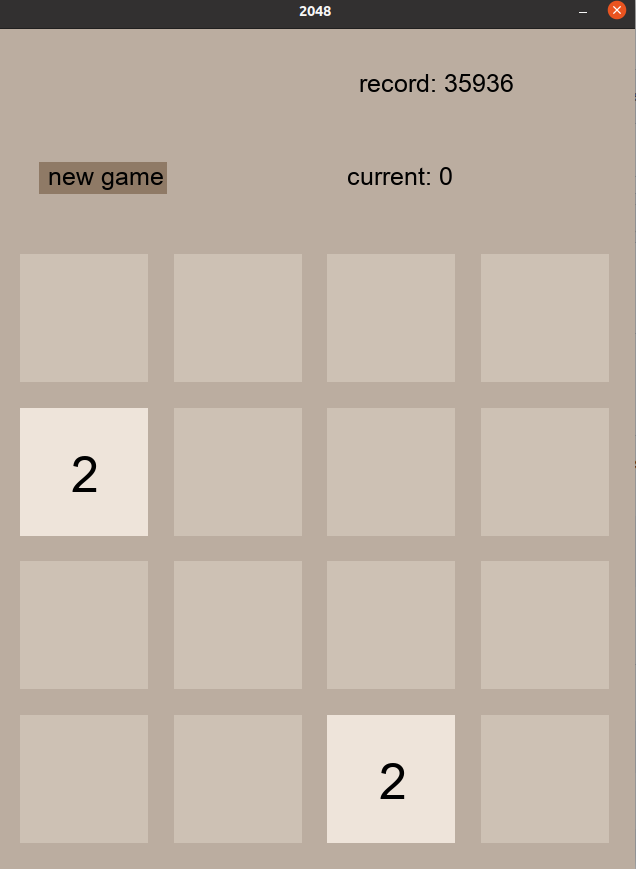
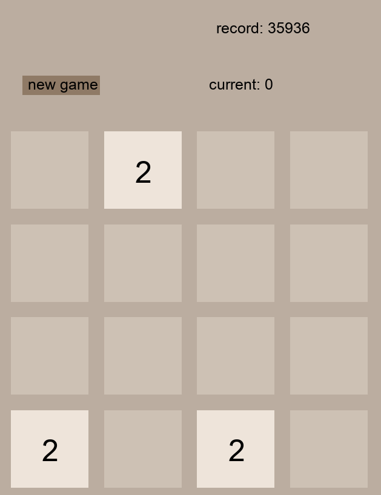
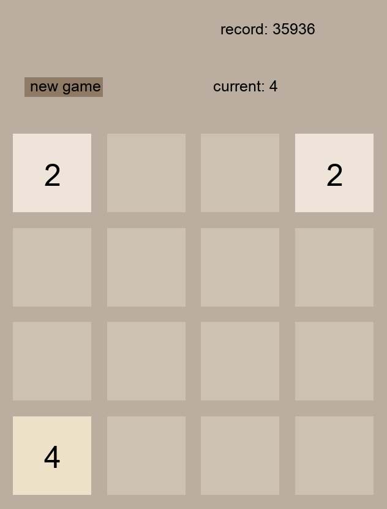

# Käyttöohje

Lataa projektin viimeisimmän [releasen](https://github.com/zzlo/ot-harjoitustyo/releases) lähdekoodi.

## Konfigurointi

Peliruudun kokoa voi konfiguroida config.py-tiedoston arvoja muuttamalla.

## Ohjelman käynnistäminen

Asenna aluksi riippuvuudet komennolla:

```bash
poetry install
```

Käynnistä sitten ohjelma komennolla:

```
poetry run invoke start
```

## Pelaaminen

Peliruutu voi aluksi näyttää esimerkiksi tältä:



Peliä voidaan pelata nuolinäppäimiä painamalla, esim. painamalla alas, lauta näyttää seuraavalta.



Laattoja voidaan yhdistää työntämällä samanarvoiset vierekkäin, edellisessä kuvassa vasemmalle painamalla.


