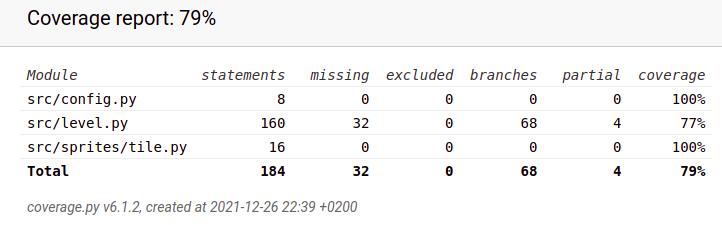

# Testausdokumentti

### Sovelluslogiikka

Sovelluslogiikasta vastaavaa `Level`-luokkaa testataan [level_test](https://github.com/zzlo/ot-harjoitustyo/blob/master/src/tests/level_test.py)-testiluokalla. `Level`-olio alustetaan, jonka jälkeen jokainen testifunktio alustaa tietynlaisen pelilaudan, ja testaa huomioiko sovelluslogiikka laudan oikein.

### Testauskattavuus

Käyttöliittymäkerrosta lukuunottamatta sovelluksen testauksen haarautumakattavuus on 77%.

Testaamatta jäi move()-funktio, jonka kutsumat funktiot ollaan testattu, mutta itse kokonaisuuden suorittava funktio on testaamatta. Myös tiedoston luvusta ja tallentamisesta vastaavat testit on tekemättä.

### Asennus ja konfigurointi

Sovellus on testattu [käyttöohjeen](./kayttoohje.md) mukaisen asennuksen jälkeen.

## Sovellukseen jääneet laatuongelmat

Sovellus ei anna virheilmoitusta, jos highscore.txt tiedostoa ollaan muokattu niin, ettei se sisällä vain numeroa. Jos käyttäjä ei koske tiedostoon ulkoisesti, niin ongelmaa ei synny.
